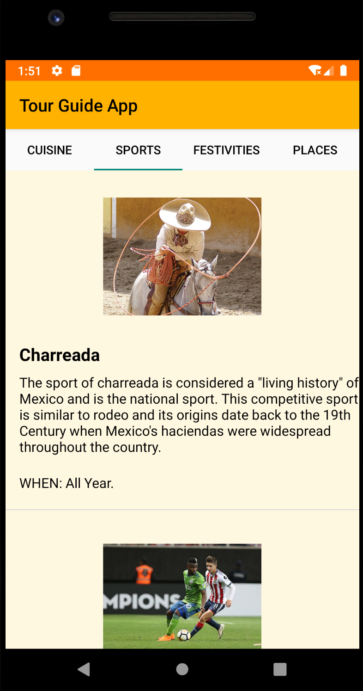
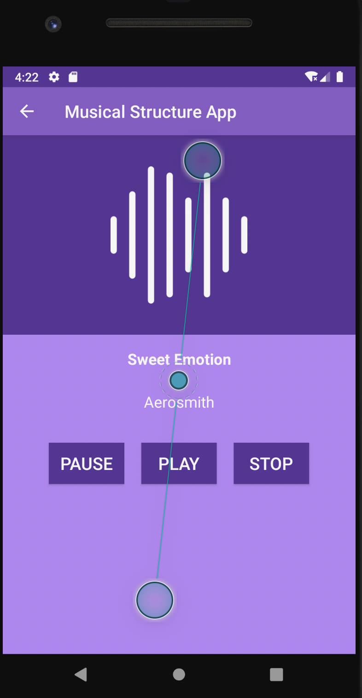

# Musical Structure App
===================================

This app consists of a list of genres and associates songs. 

This app does not play music, it is just the visual part.

This is the Project #6 for the Android Basics Nano Degree at Udacity.

# Pre-requisites
--------------

- Android SDK v30
- Android Build Tools v30.0.0
- Android Min Sdk Version v15

# Screenshots

