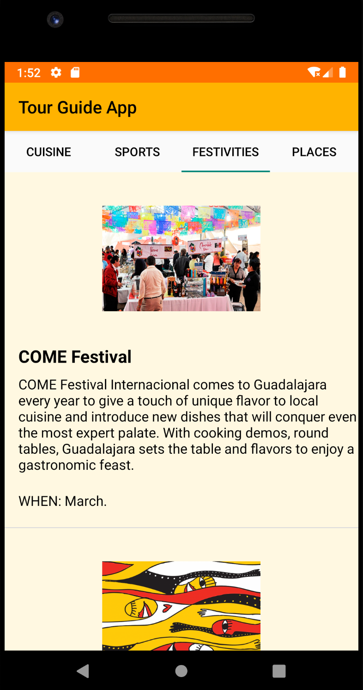

# Tour Guide App
===================================

This app consists of a list of tours and associates tour items, for the city of
Guadalajara, Mexico.

This app uses a single activity and four Fragments.

This is the Project #7 for the Android Basics Nano Degree at Udacity.

# Pre-requisites
--------------

- Android SDK v30
- Android Build Tools v30.0.0
- Android Min Sdk Version v15

# Screenshots

